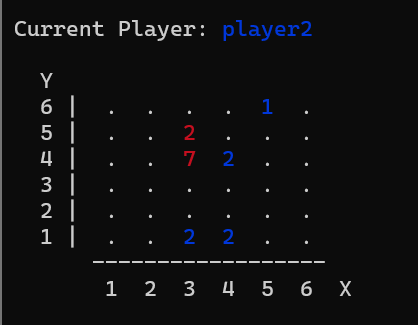

# Pratical Assignment 2
## Anaash
## Grupo Anaash_2

Rafael Filipe Barbosa da Costa - up202205013 - Contribution: 45%
Tasks:
- Valid Moves
- Value and its aplication on the greedy bot
- Game Over

Miguel Wojciech de Vasconcelos Charchalis - up201506074 - Contribution: 55%
Tasks:
- Initial State
- Display
- Move
- Random moves bot

## Instalation and execution

**On linux:**
- On the terminal, from the root of the aplication, run:

  1- `sicstus -l src/game.pl`

  2- `play.`

**On Windows:**
- Make sure the path to the SICStus bin folder is on the Path environmental variable
- On the terminal run the following commands:
  
  1- `sicstus`
  
  2- `consult(Path to game.pl).`
  
  3- `play.`

## Game Description
  Anash is a two player board game that can be played on either a 6x6 or a 8x8 board filled with a checkered pattern of red and blue checkers. The players take turns moving their pieces.
  There are three types of moves:
  - Positional moves: A player can move his stack to an orthogonally adjacent empty square. For the move to be legal, the destination square must be closer to that pieces closest stack (friendly or not) than the origin square.
  - Stacking moves: A player can place a stack on top of an othogonally adjacent, friendly stack of equal or larger height.
  - Capturing moves: A player can capture orthgonally adjacent enemy stacks of equal or smaller height.
  
  You win the game when you capture all enemy checkers.

  [Official game website](http://www.marksteeregames.com/Anaash_rules.pdf)

## Game Logic
### Game Configuration Representation
  The game configuration has three components:  
    - Game Type defines if the game will be Computer vs Computer, Computer vs Human, Human vs Computer or Human vs Human.
    - Dificulty defines the level of the AI to be used (is either 1 for random moves or 2 for the greedy algorithm.
    - Board size defines de size of the game board. It can be either small for a 6x6 board or big for an 8x8 board.
    
  The initial_state predicate uses the configuration components to generate an initial game board of the correct size and define the initial game state.
  
### Internal Game State Representation 
  The game state is reprensented by a compound term with four components:
    - Board is a list of lists with each inner list representing one row of the board. Each cell of the list has a tuple (Stack, Owner) where stack reprensents the height of the stack.
    - Current player indicates the player whose turn it is.
    - Game Type is inherited from the game configuration.
    - Difficulty is inherited from the game configuration.

  #### Examples of game states:

  Initial State:
  
    game_state([
               [(1, player1), (1, player2), (1, player1), (1, player2), (1, player1), (1, player2)],
               [(1, player2), (1, player1), (1, player2), (1, player1), (1, player2), (1, player1)],
               [(1, player1), (1, player2), (1, player1), (1, player2), (1, player1), (1, player2)],
               [(1, player2), (1, player1), (1, player2), (1, player1), (1, player2), (1, player1)],
               [(1, player1), (1, player2), (1, player1), (1, player2), (1, player1), (1, player2)],
               [(1, player2), (1, player1), (1, player2), (1, player1), (1, player2), (1, player1)]
               ],
               player1,
               computer_vs_computer,
               2)
  

               
  Intermediate State:

    game_state([
               [(0, empty), (0, empty), (0, empty), (0, empty), (1, player2), (0, empty)],
               [(0, empty), (0, empty), (2, player1), (0, empty), (0, empty), (0, empty)],
               [(0, empty), (0, empty), (7, player1), (2, player2), (0, empty), (0, empty)],
               [(0, empty), (0, empty), (0, empty), (0, empty), (0, empty), (0, empty)],
               [(0, empty), (0, empty), (0, empty), (0, empty), (0, empty), (0, empty)],
               [(0, empty), (0, empty), (2, player2), (2, player2), (0, empty), (0, empty)],
               ],
               player2,
               computer_vs_computer,
               2)
  

  Final State:

        game_state([
               [(0, empty), (0, empty), (0, empty), (0, empty), (0, empty), (0, empty)],
               [(0, empty), (0, empty), (0, empty), (9, player1), (0, empty), (0, empty)],
               [(0, empty), (0, empty), (0, empty), (0, empty), (0, empty), (0, empty)],
               [(0, empty), (0, empty), (0, empty), (0, empty), (0, empty), (0, empty)],
               [(0, empty), (0, empty), (0, empty), (0, empty), (0, empty), (0, empty)],
               [(0, empty), (0, empty), (0, empty), (0, empty), (0, empty), (0, empty)],
               ],
               player2,
               computer_vs_computer,
               2)

        
### Move Representation
  A move is represented as a pair of pairs ((OriginX, OriginY), (DestinationX, DestinationY)). X and Y are the coordinates of the relevant squares on the board.
  The move/3 predicate receives that move and the current gamestate and applies that move generating a new gamestate. The aplication of the move is done by the apply_move predicate which updates the relevant rows in the board.

### User Interaction
  The user can interact with the main menu by typing the option numbers in the terminal, in this way the user is able to change the games type, the board size, and the bots dificulty. From the main menu it is also possible to start the game with the selected settings and to close the program. If the user picks an option that does not exist they are warned that the option is invalid and prompted to try again.

  

  When it is the users turn to make a move they will be prompted to choose the piece they want to move in the form (X, Y) and then the destination square to that piece in the same (X, Y) form. The move is then validated acording to the rules of Anaash and if not valid the user is warned and prompted to make a valid move. If the user is having dificulties finding a valid move it is also possible to type "moves." when prompted to make a move to see a list of all the valid moves.

  

### Conclusions
  During the development of this project we were able to implement successfully the game of Anaash while applying and consolidating concepts learnt during this semester. Some improvements that could be made to this project are: 
  - A way to choose a custom table size.
  - An improved algorithm for a more powerfull bot.

### Bibliography
  [Official Game Website](http://www.marksteeregames.com/Anaash_rules.pdf)
  
  [ChatGPT](https://chatgpt.com)
  
  Relevant queries used with ChatGPT:  
  - Having in consideration the rules of Anaash on the attached pdf what would be a good way to calculate the value of a boardstate? (Note: This querie also included a pdf with anaash's rules. The formula returned by this query was not good enough and therefore only used as a base for our value algorithm)

  - How to write text with color in sicstus prolog? (The answer, once again, was not very good and therefore it required multiple queries to get an idea of how to implement colored text)
